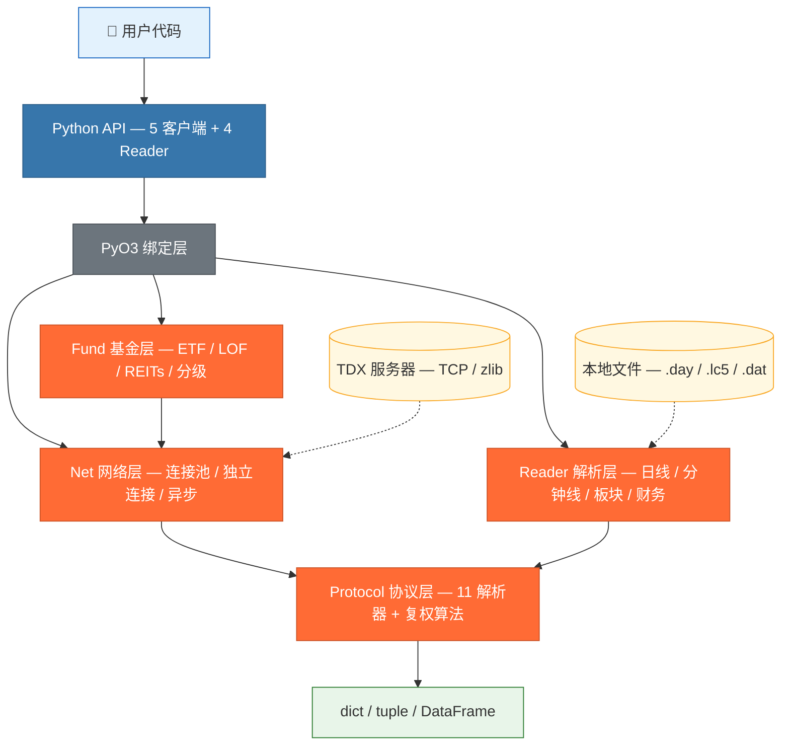

# tdxrs — 通达信行情数据解析库 (Rust + Python)

[English](README_en.md) | 中文

[](https://www.rust-lang.org/)
[](https://www.python.org/)
[](LICENSE)
[](https://pypi.org/project/tdxrs/)
[](https://pypi.org/project/tdxrs/)
[](https://github.com/jiangtaovan/tdxrs)
[](https://github.com/jiangtaovan/tdxrs)
[](https://github.com/jiangtaovan/tdxrs/commits)

**tdxrs** 是通达信 (TDX) 行情数据解析库的 Rust 高性能实现。通过 PyO3/maturin 提供 Python 调用接口，保持与 Python [tdxpy](https://github.com/rainx/pytdx) 的 API 兼容，本地解析性能提升 **9-11 倍**。

```python
from tdxrs import TdxHqClient
from tdxrs.constants import MARKET_SH, KLINE_DAILY, FQ_QFQ

client = TdxHqClient()
client.connect_to_any()

# 贵州茅台日K → DataFrame
df = client.get_security_bars_dataframe(KLINE_DAILY, MARKET_SH, "600519", 0, 500)
df["ma20"] = df["close"].rolling(20).mean()

# 批量实时行情 (上限 60 只/次)
quotes = client.get_security_quotes([
    (MARKET_SH, "600519"), (0, "000858"), (0, "300750")
])
```

---

## 性能

### 本地文件解析

| 操作 | tdxrs (Rust) | tdxpy (Python) | 加速比 |
|------|------------:|--------------:|:-----:|
| 日线 1000 条 | 0.3ms | 2.8ms | **9×** |
| 分钟线 1000 条 | 0.5ms | 5.1ms | **10×** |
| 板块 500 条 | 1.2ms | 12.0ms | **10×** |
| 财务 500 条 | 0.8ms | 8.5ms | **11×** |

### 网络 API (连接池模式)

| 操作 | tdxrs | tdxpy | 加速比 |
|------|------:|------:|:-----:|
| K 线 100 条 | 73ms | 110ms | **1.5×** |
| 行情 3 只 | 75ms | 95ms | **1.3×** |
| 日K 800 条 | 290ms | — | — |

### 并发性能 (60 线程)

| 方案 | 5 线程 | 60 线程 | 扩展比 |
|------|------:|------:|:-----:|
| 裸连接 (Direct) | 381ms | 344ms | **0.9×** (零退化) |
| 连接池 (Pool) | 337ms | 4110ms | 12.2× |
| 异步 (Async) | 345ms | 3880ms | 11.2× |

> 详见 [性能基准](docs/public/BENCHMARKS.md)。

---

## 功能

### 网络行情 (13 类数据)

| 数据 | 覆盖 |
|------|------|
| **K 线** | 个股 + 指数，12 种周期 (1分钟 ~ 年线) |
| **实时行情** | 五档盘口，含成交额/总量 |
| **分时数据** | 当日 + 历史 (按日期查询) |
| **逐笔成交** | 当日 + 历史 (按日期查询，自动翻页) |
| **证券信息** | 全市场列表 + 数量 (带缓存) |
| **财务数据** | 实时 34 项 + 45 个英文命名财务指标 |
| **除权除息** | 分红/送股/配股/缩股历史 |
| **板块数据** | 行业/概念/地域分类 |

### 基金数据 (ETF/LOF/REITs/分级基金)

`TdxHqFundClient` 提供基金专用 API，接口格式与股票一致：

```python
from tdxrs import TdxHqFundClient
from tdxrs.constants import MARKET_SH, MARKET_SZ, KLINE_DAILY

client = TdxHqFundClient()
client.connect_to_any()

# 基金实时行情 (上限 60 只/次)
quotes = client.get_fund_quotes([
    (MARKET_SH, "510300"),   # 沪深300ETF
    (MARKET_SZ, "159915"),   # 创业板ETF
])

# 基金 K 线 (接口与股票相同)
bars = client.get_fund_bars(KLINE_DAILY, MARKET_SH, "510300", 0, 100)

# 基金列表
funds = client.get_fund_list(MARKET_SH)  # 返回 code, name, fund_type
```

| 类型 | 代码前缀 | 示例 |
|------|---------|------|
| ETF | 510/512/513/515/516, 159 | 510300 沪深300ETF |
| LOF | 501/502, 160/161 | 160105 南方积配 |
| REITs | 508 | 508000 普洛斯 |
| 分级基金 | 162/163/164 | 162006 银华锐进 |
| 债券基金 | 511 | 511010 国债ETF |
| 场外基金 | 519 | 519003 海富通收益 |

> 详细说明见 [基金模块文档](docs/public/FUND.md)。

### 客户端侧复权计算

TDX 服务端返回未复权原始数据。tdxrs 在客户端自行计算前复权/后复权：
- 中国 A 股标准除权除息公式
- 支持分红+送股+配股联动
- 自动补全早期除权事件 (context_bars 机制)
- `fq=0` 路径零额外开销

### 四种客户端方案

| 客户端 | 策略 | 场景 |
|-------|------|------|
| `TdxHqClient` | 连接池(5) + 心跳 + 重试 + 缓存 | 主力，顺序请求 |
| `TdxHqFundClient` | 共享连接池 + 基金代码验证 | 基金数据 |
| `TdxDirectClient` | 每请求独立 TCP | 高并发 (60线程零退化) |
| `AsyncTdxHqClient` | tokio 异步 + 心跳 | 异步生态集成 |

### 请求限流

内置交易时段自适应限流，保护服务器：

| 时段 | 默认限流 | 说明 |
|------|:--------:|------|
| 盘中 (9:30-15:00) | 15 req/s | 交易活跃期 |
| 盘前/盘后 | 30 req/s | 过渡时段 |
| 休市 | 60 req/s | 非交易日 |

```python
client = TdxHqClient()
client.connect_to_any()
client.auto_detect_phase()  # 自动检测当前时段
# 或手动设置
client.set_phase("trading")  # trading / prepost / closed
```

> 每连接独立限流，4 连接池实际吞吐 ×4。批量行情单次上限 60 只，超出自动截断。

### 本地文件解析

| 格式 | Reader | 输出 |
|------|--------|------|
| `.day` 日线 | `DailyBarReader` | dict / tuple / DataFrame |
| `.lc5` `.lc1` 分钟线 | `MinBarReader` `LcMinBarReader` | 同上 |
| `.dat` 板块 | `BlockReader` | flat / group 两种模式 |
| `gpcw*.dat` 财务 | `FinancialReader` | f32 字段数组 |

### 批量下载 (`tdxrs.downloader`)

多服务器分发 + 自动翻页 + 增量更新 + 断点续传：

```python
from tdxrs.downloader import Downloader

# 日线下载 (默认 .day 格式，原始数据 fq=0)
dl = Downloader(data_dir="./data")
dl.run(markets=["sh", "sz"], categories=["daily"])
dl.update()  # 增量更新 (仅 fq=0 支持)

# 按日下载分时/逐笔数据 (需指定股票代码)
dl.download_minute(dates=["2026-06-25"], codes=["600519", "000858"])
dl.download_ticks(dates=["2026-06-25"], codes=["600519"])
```

### CLI 命令行

无需编写代码，直接在终端查询行情：

```bash
tdxrs quote 600519,000858          # 实时行情
tdxrs bars 600519 --count 30 --fq 1  # K线 (前复权)
tdxrs trades 600519 --count 100      # 逐笔成交
tdxrs download --market sh --category daily  # 批量下载
tdxrs servers                        # 测试服务器
```

> 完整文档见 [CLI 使用指南](docs/public/CLI.md)。

---

## 安装

```bash
pip install tdxrs
```

或从源码构建：

```bash
git clone https://github.com/jiangtaovan/tdxrs && cd tdxrs
pip install maturin
maturin develop --release
```

Windows `x86_64-pc-windows-gnu` 需额外安装 [MSYS2 dlltool](docs/INSTALL.md)。详见 [安装说明](docs/INSTALL.md)。

---

## 快速示例

### K 线 — 完整复权演示

```python
from tdxrs import TdxHqClient
from tdxrs.constants import MARKET_SH, KLINE_DAILY, KLINE_WEEKLY, FQ_QFQ, FQ_HFQ, FQ_NONE

client = TdxHqClient()
client.connect_to_any()

# 前复权 (默认)
bars = client.get_security_bars(KLINE_DAILY, MARKET_SH, "600519", 0, 100)

# 未复权原始数据
raw = client.get_security_bars(KLINE_DAILY, MARKET_SH, "600519", 0, 100, fq=FQ_NONE)

# 后复权
hfq = client.get_security_bars(KLINE_DAILY, MARKET_SH, "600519", 0, 100, fq=FQ_HFQ)

# 周K + 自动分页 (3000条)
all_bars = client.get_security_bars_all(KLINE_WEEKLY, MARKET_SH, "600519", count=3000)

# Tuple 高性能模式 (快 40-60%)
tuples = client.get_security_bars_tuples(KLINE_DAILY, MARKET_SH, "600519", 0, 500)
# → (open, close, high, low, vol, amount, year, month, day, hour, minute, datetime)

client.disconnect()
```

### 多股票批量财务

```python
# 实时财务 (TDX 原始值, 不自动转换单位)
info = client.get_finance_info(market=1, code="600519")
# 经验规则: 股本类 ≈万元, 资产类 ≈万元, 每股指标 ≈元
print(f"净资产: {info['jingzichan']:.0f}")   # e.g. 270894048 → 2709亿元
print(f"每股净资产: {info['meigujingzichan']:.2f}")  # 216.32元

# 多股票对比 DataFrame
df = client.get_finance_info_dataframe([
    (MARKET_SH, "600519"), (MARKET_SZ, "000858"), (MARKET_SZ, "300750")
])
print(df[["code", "jingzichan", "jinglirun", "meigujingzichan"]])
```

### 本地文件解析

```python
from tdxrs import DailyBarReader

reader = DailyBarReader(coefficient=0.01)
df = reader.to_dataframe(open("600519.day", "rb").read())
# df.columns: date, open, high, low, close, amount, volume, year, month, day
```

---

## 工程亮点

```
语言:    Rust 2021 edition, 0 行 unsafe
测试:    139 个单元/集成测试
依赖:    6 个核心 crate (pyo3, flate2, tokio, serde, thiserror, encoding_rs)
文档:    12 篇维护文档 (6 public + 6 internal)
```

---

## 架构



**客户端**：`TdxHqClient`（连接池 + 心跳 + 重试）、`TdxHqFundClient`（基金专用）、`TdxDirectClient`（独立连接，高并发）、`AsyncTdxHqClient`（tokio 异步）

**Reader**：`DailyBarReader`（.day 日线）、`MinBarReader` / `LcMinBarReader`（.lc5 分钟线）、`BlockReader`（.dat 板块）、`FinancialReader`（gpcw 财务）

**输出格式**：`list[dict]`（调试）、`list[tuple]`（遍历，快 40-60%）、`DataFrame`（分析回测）

> 📖 详细架构说明见 [ARCHITECTURE.md](docs/public/ARCHITECTURE.md)

---

## 文档

| 文档 | 说明 |
|------|------|
| [API 参考](docs/public/API_REFERENCE.md) | 完整 Python API + 最佳实践 |
| [架构说明](docs/public/ARCHITECTURE.md) | 模块设计、数据流、客户端策略 |
| [性能基准](docs/public/BENCHMARKS.md) | 顺序/并发性能 + 场景选择指南 |
| [CLI 指南](docs/public/CLI.md) | 命令行工具使用说明 |
| [基金模块](docs/public/FUND.md) | 基金数据 (ETF/LOF/REITs/分级基金) |
| [复权算法](docs/ADJUSTER_ALGORITHM.md) | 公式推导、版本迭代、验证方法 |
| [变更日志](docs/public/CHANGELOG.md) | 版本历史 |
| [贡献指南](docs/public/CONTRIBUTING.md) | 参与开发 + 可贡献方向 |
| [安装说明](docs/INSTALL.md) | 环境配置 + FAQ |

---

## 要求

- **Rust** 1.83+ | **Python** 3.11+ | **maturin** 1.5+
- pandas (可选, DataFrame 输出)

---

## 免责声明

- 本项目仅供**学习和研究**用途，不构成任何投资建议
- 本项目不保证数据的准确性、完整性和时效性
- 通达信行情数据的版权归相关数据提供商所有
- 用户使用本项目获取的数据用于商业用途时，需自行解决数据授权合规问题
- 本项目按 [MIT License](LICENSE) 发布，作者不对因使用本项目产生的任何损失承担责任

---

## 许可证

MIT License — 详见 [LICENSE](LICENSE)

---

## Star History

<a href="https://www.star-history.com/?repos=jiangtaovan%2Ftdxrs&type=Date">
 <picture>
   <source media="(prefers-color-scheme: dark)" srcset="https://api.star-history.com/chart?repos=jiangtaovan/tdxrs&type=Date&theme=dark" />
   <source media="(prefers-color-scheme: light)" srcset="https://api.star-history.com/chart?repos=jiangtaovan/tdxrs&type=Date" />
   
 </picture>
</a>
