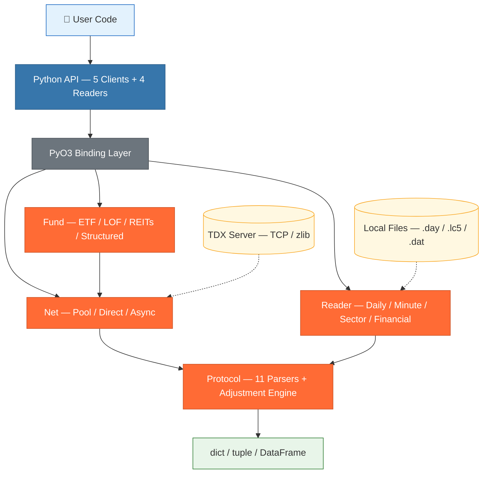

# tdxrs — TongDaXin (TDX) Market Data Parser (Rust + Python)

English | [中文](README.md)

[](https://www.rust-lang.org/)
[](https://www.python.org/)
[](LICENSE)
[](https://pypi.org/project/tdxrs/)
[](https://pypi.org/project/tdxrs/)
[](https://github.com/jiangtaovan/tdxrs)
[](https://github.com/jiangtaovan/tdxrs)
[](https://github.com/jiangtaovan/tdxrs/commits)

**tdxrs** is a high-performance Rust implementation of the TongDaXin (TDX) market data parser. It provides Python bindings via PyO3/maturin, maintains API compatibility with the Python [tdxpy](https://github.com/rainx/pytdx) library, and achieves **9-11x** speedup in local file parsing.

```python
from tdxrs import TdxHqClient
from tdxrs.constants import MARKET_SH, KLINE_DAILY, FQ_QFQ

client = TdxHqClient()
client.connect_to_any()

# Kweichow Moutai daily K-line → DataFrame
df = client.get_security_bars_dataframe(KLINE_DAILY, MARKET_SH, "600519", 0, 500)
df["ma20"] = df["close"].rolling(20).mean()

# Batch real-time quotes (up to 60 per request)
quotes = client.get_security_quotes([
    (MARKET_SH, "600519"), (0, "000858"), (0, "300750")
])
```

---

## Performance

### Local File Parsing

| Operation | tdxrs (Rust) | tdxpy (Python) | Speedup |
|-----------|------------:|--------------:|:------:|
| Daily K-line 1,000 bars | 0.3ms | 2.8ms | **9x** |
| Minute K-line 1,000 bars | 0.5ms | 5.1ms | **10x** |
| Sector data 500 entries | 1.2ms | 12.0ms | **10x** |
| Financial data 500 entries | 0.8ms | 8.5ms | **11x** |

### Network API (Connection Pool Mode)

| Operation | tdxrs | tdxpy | Speedup |
|-----------|------:|------:|:------:|
| K-line 100 bars | 73ms | 110ms | **1.5x** |
| Quotes 3 stocks | 75ms | 95ms | **1.3x** |
| Daily K-line 800 bars | 290ms | — | — |

### Concurrency (60 Threads)

| Strategy | 5 threads | 60 threads | Scaling |
|----------|--------:|--------:|:------:|
| Direct (standalone) | 381ms | 344ms | **0.9x** (no degradation) |
| Connection Pool | 337ms | 4110ms | 12.2x |
| Async (tokio) | 345ms | 3880ms | 11.2x |

> See [Benchmarks](docs/public/BENCHMARKS.md) for details.

---

## Features

### Market Data (13 Data Types)

| Data | Coverage |
|------|----------|
| **K-line** | Stocks + indices, 12 periods (1-min to yearly) |
| **Real-time quotes** | 5-level order book, volume & turnover |
| **Intraday data** | Current day + historical (by date) |
| **Tick data** | Current day + historical (by date, auto-paginated) |
| **Security info** | Full market listing + count (cached) |
| **Financial data** | 34 real-time fields + 45 named financial indicators |
| **Ex-dividend/rights** | Dividends, bonus shares, rights issues, capital reductions |
| **Sector data** | Industry / concept / regional classifications |

### Fund Data (ETF / LOF / REITs / Structured Funds)

`TdxHqFundClient` provides a dedicated fund API with the same interface as stocks:

```python
from tdxrs import TdxHqFundClient
from tdxrs.constants import MARKET_SH, MARKET_SZ, KLINE_DAILY

client = TdxHqFundClient()
client.connect_to_any()

# Fund real-time quotes (up to 60 per request)
quotes = client.get_fund_quotes([
    (MARKET_SH, "510300"),   # CSI 300 ETF
    (MARKET_SZ, "159915"),   # ChiNext ETF
])

# Fund K-line (same interface as stocks)
bars = client.get_fund_bars(KLINE_DAILY, MARKET_SH, "510300", 0, 100)

# Fund listing
funds = client.get_fund_list(MARKET_SH)  # returns code, name, fund_type
```

| Type | Code Prefix | Example |
|------|-------------|---------|
| ETF | 510/512/513/515/516, 159 | 510300 CSI 300 ETF |
| LOF | 501/502, 160/161 | 160105 Southern Growth LOF |
| REITs | 508 | 508000 GLP REIT |
| Structured | 162/163/164 | 162006 Yinhua Leveraged |
| Bond ETF | 511 | 511010 Treasury Bond ETF |
| Off-market | 519 | 519003 Haifutong Growth |

> See [Fund Module](docs/public/FUND.md) for details.

### Client-Side Price Adjustment

TDX servers return unadjusted raw data. tdxrs computes forward/backward adjustments client-side:
- Standard Chinese A-share ex-dividend formula
- Supports combined dividend + bonus shares + rights issues
- Automatic backfilling of early ex-dividend events (context_bars mechanism)
- Zero overhead on the `fq=0` (unadjusted) path

### Four Client Strategies

| Client | Strategy | Use Case |
|--------|----------|----------|
| `TdxHqClient` | Pool(5) + heartbeat + retry + cache | Primary, sequential requests |
| `TdxHqFundClient` | Shared pool + fund code validation | Fund data |
| `TdxDirectClient` | Standalone TCP per request | High concurrency (60 threads, no degradation) |
| `AsyncTdxHqClient` | tokio async + heartbeat | Async ecosystem integration |

### Rate Limiting

Built-in adaptive rate limiting by trading session to protect servers:

| Session | Default Rate | Description |
|---------|:-----------:|-------------|
| Trading (9:30-15:00) | 15 req/s | Active trading hours |
| Pre/Post market | 30 req/s | Transition periods |
| Closed | 60 req/s | Non-trading days |

```python
client = TdxHqClient()
client.connect_to_any()
client.auto_detect_phase()  # auto-detect current session
# or set manually
client.set_phase("trading")  # trading / prepost / closed
```

> Rate limiting is per-connection; a 4-connection pool yields 4x throughput. Batch quotes are capped at 60 per request with automatic truncation.

### Local File Parsing

| Format | Reader | Output |
|--------|--------|--------|
| `.day` daily bars | `DailyBarReader` | dict / tuple / DataFrame |
| `.lc5` `.lc1` minute bars | `MinBarReader` `LcMinBarReader` | Same as above |
| `.dat` sector data | `BlockReader` | flat / group modes |
| `gpcw*.dat` financial | `FinancialReader` | f32 field arrays |

### Batch Download (`tdxrs.downloader`)

Multi-server rotation + auto-pagination + incremental updates + resume support:

```python
from tdxrs.downloader import Downloader

# Daily download (default .day format, raw data fq=0)
dl = Downloader(data_dir="./data")
dl.run(markets=["sh", "sz"], categories=["daily"])
dl.update()  # incremental update (fq=0 only)

# Download intraday/tick data by date (stock codes required)
dl.download_minute(dates=["2026-06-25"], codes=["600519", "000858"])
dl.download_ticks(dates=["2026-06-25"], codes=["600519"])
```

### CLI

Query market data directly from the terminal:

```bash
tdxrs quote 600519,000858          # Real-time quotes
tdxrs bars 600519 --count 30 --fq 1  # K-line (forward-adjusted)
tdxrs trades 600519 --count 100      # Tick data
tdxrs download --market sh --category daily  # Batch download
tdxrs servers                        # Test server connectivity
```

> See [CLI Guide](docs/public/CLI.md) for details.

---

## Installation

```bash
pip install tdxrs
```

Or build from source:

```bash
git clone https://github.com/jiangtaovan/tdxrs && cd tdxrs
pip install maturin
maturin develop --release
```

Windows `x86_64-pc-windows-gnu` requires [MSYS2 dlltool](docs/INSTALL.md). See [Installation Guide](docs/INSTALL.md).

---

## Quick Examples

### K-line — Full Adjustment Demo

```python
from tdxrs import TdxHqClient
from tdxrs.constants import MARKET_SH, KLINE_DAILY, KLINE_WEEKLY, FQ_QFQ, FQ_HFQ, FQ_NONE

client = TdxHqClient()
client.connect_to_any()

# Forward-adjusted (default)
bars = client.get_security_bars(KLINE_DAILY, MARKET_SH, "600519", 0, 100)

# Unadjusted raw data
raw = client.get_security_bars(KLINE_DAILY, MARKET_SH, "600519", 0, 100, fq=FQ_NONE)

# Backward-adjusted
hfq = client.get_security_bars(KLINE_DAILY, MARKET_SH, "600519", 0, 100, fq=FQ_HFQ)

# Weekly K-line + auto-pagination (3,000 bars)
all_bars = client.get_security_bars_all(KLINE_WEEKLY, MARKET_SH, "600519", count=3000)

# Tuple high-performance mode (40-60% faster)
tuples = client.get_security_bars_tuples(KLINE_DAILY, MARKET_SH, "600519", 0, 500)
# → (open, close, high, low, vol, amount, year, month, day, hour, minute, datetime)

client.disconnect()
```

### Multi-Stock Financial Comparison

```python
# Real-time financials (TDX raw values, no unit conversion)
info = client.get_finance_info(market=1, code="600519")
# Heuristic: share capital ≈ 10k CNY, assets ≈ 10k CNY, per-share ≈ CNY
print(f"Net assets: {info['jingzichan']:.0f}")          # e.g. 270894048 → ~27B CNY
print(f"Book value/share: {info['meigujingzichan']:.2f}")  # 216.32 CNY

# Multi-stock comparison as DataFrame
df = client.get_finance_info_dataframe([
    (MARKET_SH, "600519"), (MARKET_SZ, "000858"), (MARKET_SZ, "300750")
])
print(df[["code", "jingzichan", "jinglirun", "meigujingzichan"]])
```

### Local File Parsing

```python
from tdxrs import DailyBarReader

reader = DailyBarReader(coefficient=0.01)
df = reader.to_dataframe(open("600519.day", "rb").read())
# df.columns: date, open, high, low, close, amount, volume, year, month, day
```

---

## Engineering Highlights

```
Language:  Rust 2021 edition, zero unsafe
Tests:     139 unit / integration tests
Deps:      6 core crates (pyo3, flate2, tokio, serde, thiserror, encoding_rs)
Docs:      12 maintained documents (6 public + 6 internal)
```

---

## Architecture



**Clients**: `TdxHqClient` (connection pool + heartbeat + retry), `TdxHqFundClient` (fund-specific), `TdxDirectClient` (standalone, high concurrency), `AsyncTdxHqClient` (tokio async)

**Readers**: `DailyBarReader` (.day), `MinBarReader` / `LcMinBarReader` (.lc5), `BlockReader` (.dat), `FinancialReader` (gpcw)

**Output formats**: `list[dict]` (debugging), `list[tuple]` (iteration, 40-60% faster), `DataFrame` (analysis & backtesting)

> See [ARCHITECTURE.md](docs/public/ARCHITECTURE.md) for details.

---

## Documentation

| Document | Description |
|----------|-------------|
| [API Reference](docs/public/API_REFERENCE.md) | Complete Python API + best practices |
| [Architecture](docs/public/ARCHITECTURE.md) | Module design, data flow, client strategies |
| [Benchmarks](docs/public/BENCHMARKS.md) | Sequential / concurrent performance + scenario guide |
| [CLI Guide](docs/public/CLI.md) | Command-line tool usage |
| [Fund Module](docs/public/FUND.md) | Fund data (ETF / LOF / REITs / structured) |
| [Adjustment Algorithm](docs/ADJUSTER_ALGORITHM.md) | Formula derivation, version history, verification |
| [Changelog](docs/public/CHANGELOG.md) | Version history |
| [Contributing](docs/public/CONTRIBUTING.md) | How to contribute |
| [Installation](docs/INSTALL.md) | Environment setup + FAQ |

---

## Requirements

- **Rust** 1.83+ | **Python** 3.11+ | **maturin** 1.5+
- pandas (optional, for DataFrame output)

---

## Disclaimer

- This project is for **educational and research purposes only** and does not constitute investment advice
- No guarantee of data accuracy, completeness, or timeliness
- TongDaXin market data is copyrighted by the respective data providers
- Users are responsible for obtaining proper data licensing for commercial use
- Released under the [MIT License](LICENSE); the author assumes no liability for any damages arising from the use of this project

---

## License

MIT License — see [LICENSE](LICENSE)

---

## Star History

<a href="https://www.star-history.com/?repos=jiangtaovan%2Ftdxrs&type=Date">
 <picture>
   <source media="(prefers-color-scheme: dark)" srcset="https://api.star-history.com/chart?repos=jiangtaovan/tdxrs&type=Date&theme=dark" />
   <source media="(prefers-color-scheme: light)" srcset="https://api.star-history.com/chart?repos=jiangtaovan/tdxrs&type=Date" />
   
 </picture>
</a>
